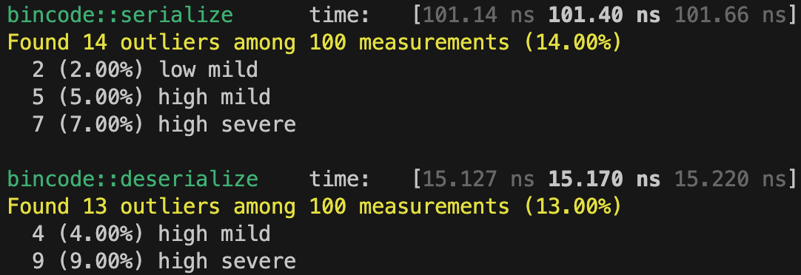

# This module contains a number of training examples and bench mark comparisons

## Training Examples
* follow [here](./examples/readme.md)

## Bench Marks

* These benchmarks are a comparison of three other popular formats, which are [serde_json](https://crates.io/crates/serde_json) and [rmp-serde](https://crates.io/crates/rmp-serde), and [bincode](https://github.com/bincode-org/bincode) with [byteserde](https://crates.io/crates/byteserde)
* To make the results of the comparison fare the following [reference](./benches/sample.rs) structure was used to produce below measurement on a MacOS. Results may vary on a different OS & hardware but will be directionally similar.

### Results
  
### `byteserde`


### `bincode`



### `rmp-serde`


### `serde_json`


### To try your self run.
* `byteserde`
```shell
cargo bench --bench byteserde_bench
```
* `rmp-serde`
```shell
cargo bench --bench serde_rmp_bench
```
* `serde_json`
```shell
cargo bench --bench serde_json_bench
```