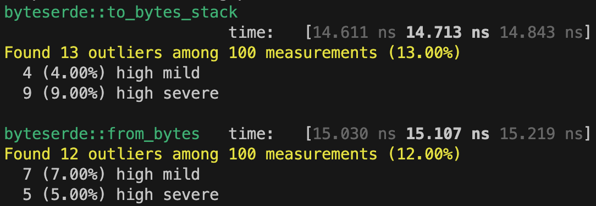
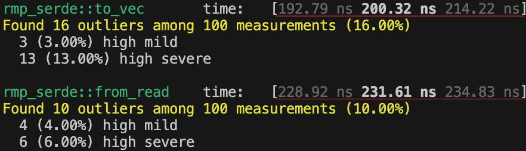
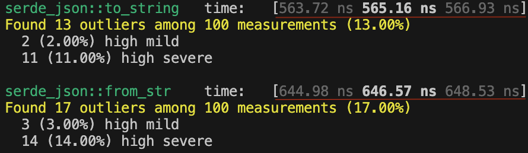

# This module contains a number of training examples and bench mark comparisons

## Training Examples
* follow [here](./examples/readme.md)

## Bench Marks

* These benchmarks are a comparison of two other popular formats, which are [serde_json](https://crates.io/crates/serde_json) and [rmp-serde](https://crates.io/crates/rmp-serde), with [byteserde](https://crates.io/crates/byteserde)
* To make the results of the comparison fare the following [reference](./benches/sample.rs) structure was used to produce below measurement.

### Results
  
### `byteserde` - takes about ~`30ns` to read or write to a byte stream



### `rmp-serde` - takes about ~`215ns` to read or write to a byte stream, which is about `seven` times slower, likely due to the `serde` interface overhead



### `serde_json` - takes about ~`600ns` to read or write to a byte stream, which is about `twenty` times slower, undestandably due to its reliance on a string result.



### To try your self run.
* `byteserde`
```shell
cargo bench --bench byteserde_bench
```
* `rmp-serde`
```shell
cargo bench --bench serde_rmp_bench
```
* `serde_json`
```shell
cargo bench --bench serde_json_bench
```